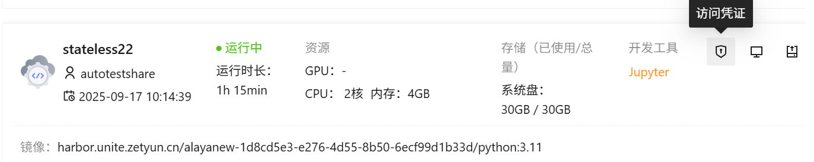
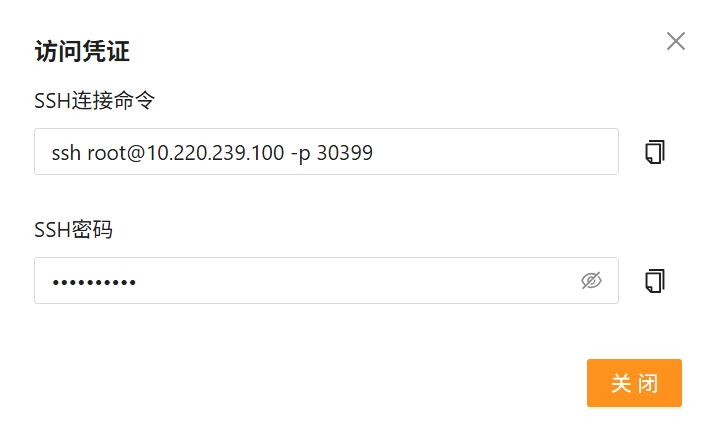
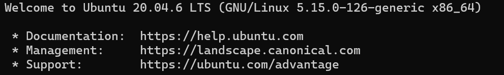
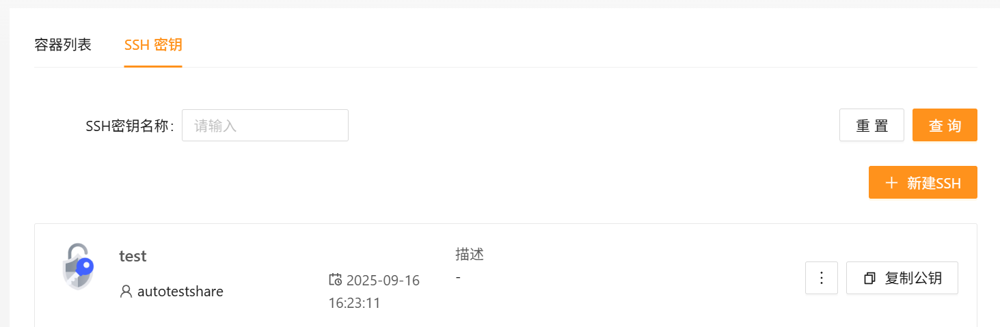
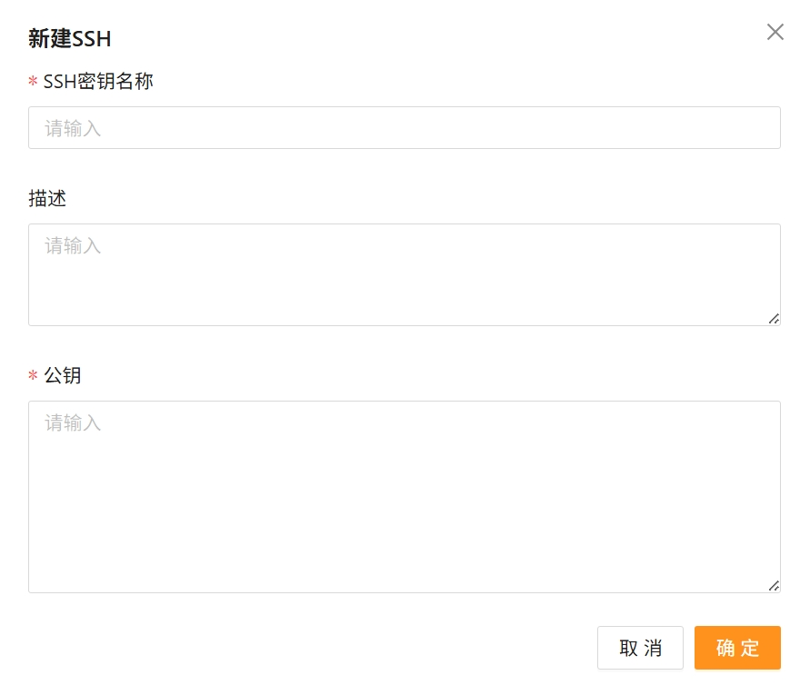

# SSH访问容器实例
平台支持通过SSH远程连接访问容器实例，同时支持通过配置SSH公钥免密访问容器实例。

- 平台已在实例启动时内置 openssh-server 服务，用户可跳过服务安装与开启步骤、直接使用“SSH访问”功能。
- 当容器实例状态为“运行中”时，用户可使用“SSH访问”功能。
- 公钥创建成功后，系统将在之后创建的容器实例自动注入当前列表内的所有公钥，本地远程访问容器实例将无需使用密码。
- 创建公钥前已经创建成功的容器实例不会自动注入该公钥，用户可通过重启实例实现免密访问。

## SSH登录
1.创建容器实例，在操作栏中点击访问凭证。

2.在窗口中复制SSH连接命令。

3.打开本地主机的终端。  
- Windows用户可以使用系统自带的Powershell/CMD登录。  
- Mac用户可以使用系统自带的Terminal完成SSH登录。  

4.粘贴 SSH 命令和密码，即可访问容器实例。


## 免密登录
### 1.生成 SSH 密钥对
（若本地已有公钥文件，则跳过此步骤）  

**在终端执行命令**
```
ssh-keygen
```
**复制密钥对**  
进入 SSH 公钥所在目录，可查看公钥内容：
- Windows 系统  
SSH 公钥文件目录为 C:\user{user_name}\.ssh\id_rsa.pub  
- Linux 系统  
SSH 公钥文件目录为 ~/.ssh/id_rsa.pub  

执行以下命令可复制公钥内容：
```
cat id_rsa.pub
```

### 2.注入 SSH 密钥
1.登录控制台，进入 产品中心 -> 计算 -> 云容器实例页面。  
2.选择Tab页中的 SSH 密钥，点击 +新建SSH。


3.在新建 SSH 密钥窗口中，配置SSH密钥名称、描述、公钥，点击确定。


|  参数   | 说明  |
|  ----  | ----  |
| SSH密钥名称  | 当前 SSH 密钥的名称 |
| 描述  | 针对当前 SSH 密钥的备注信息|
| 公钥  | 本地主机的 SSH 公钥。（若本地没有公钥文件，则可参考 附录1 生成）|

4.创建成功后密钥以列表形式显示。  
5.用户可复制公钥、或删除已创建的SSH密钥。 

### 3.访问容器实例
打开本地主机的终端，使用指定端口进行连接。  
如果配置正确，将实现免密访问。